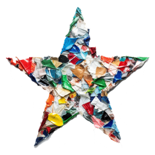
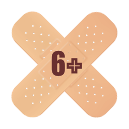
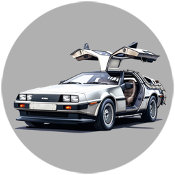
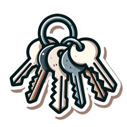
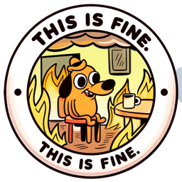

<a href="https://github.com/my-badges/my-badges"></a>

# My Badges

— _Do you like GitHub Achievements?_  
— _Do you want to get more badges?_  
— _We got you covered!_

**My Badges** is a GitHub Action that generates badges for your profile README.md.
Badges will be updated automatically every day. And you will get new badges as you progress, or
as community adds new badges. **Yes, you can [add your own badges](CONTRIBUTING.md)!**

But how does those badges look like? Take a look [here](https://github.com/antonmedv),
or [here](https://github.com/antongolub).

<p>

> update-my-badges@1.0.136 check-images
> node dist/check-images.js
















</p>

## Installation

Here is how to add my badges to your profile:

- Star this repository.
-

Create `your-username/your-username` [GH profile repository](https://docs.github.com/en/account-and-profile/setting-up-and-managing-your-github-profile/customizing-your-profile/managing-your-profile-readme).

- In `README.md` add the following code:

```html
<!-- my-badges start -->
<!-- my-badges end -->
```

- Add the following workflow `.github/workflows/my-badges.yml` to your repository.

```yaml
name: my-badges

on:
  workflow_dispatch:
  schedule:
    - cron: '0 0 * * *'

permissions:
  contents: write

jobs:
  my-badges:
    runs-on: ubuntu-latest
    steps:
      - name: Update My Badges
        run: npx update-my-badges ${{github.repository_owner}}
        env:
          GITHUB_TOKEN: ${{ secrets.GITHUB_TOKEN }}
```

- Start **my-badges** workflow, or wait for it to run automatically.

## Configuration

| Param   | ENV alias      | Description                    | Default       |
|---------|----------------|--------------------------------|---------------|
| `token` | `GITHUB_TOKEN` | Auth token                     |               |
| `user`  | `GITHUB_USER`  | Username                       |               |
| `repo`  | `GITHUB_REPO`  | Repository name to push badges | `{user/user}` |

<details>
<summary>Additional params</summary>

| Param     | Description                                                                                                                                             | Default |
|-----------|---------------------------------------------------------------------------------------------------------------------------------------------------------|---------|
| `data`    | Path to JSON to generate badges. If empty, required data will be obtained from the GH API                                                               |         |
| `size`    | Badge size for README.md, px                                                                                                                            | 64      |
| `dryrun`  | Generate badges, but skip pushing them to git                                                                                                           |         |
| `pick`    | List of badges to pick. Pass `--pick="a-commit,ab-commit,revert-revert-commit"` to generate only the specified entries. If empty gets all of them       |         |
| `omit`    | List of badges to exclude. For example, if you're too shy to flex your stars: `--omit:stars-100,stars-500,stars-1000` or even shorter `--omit:stars-*`  |         |
| `compact` | Represent the highest tier badges in README.md. For example, If you have both `stars-100` and `stars-500` achievements, only the last one will be shown |         |

</details>

### Manual Run

- Go to `username/username` local repo.
- Run `npx update-my-badges --user <username> --token=<token> --dryrun`.
- Verify `my-badges` and `readme.md` changes.
- Push a commit: `git add -- . ':!data' && git commit -m "chore: update my-bagdes"`.

## License

[MIT](LICENSE)
