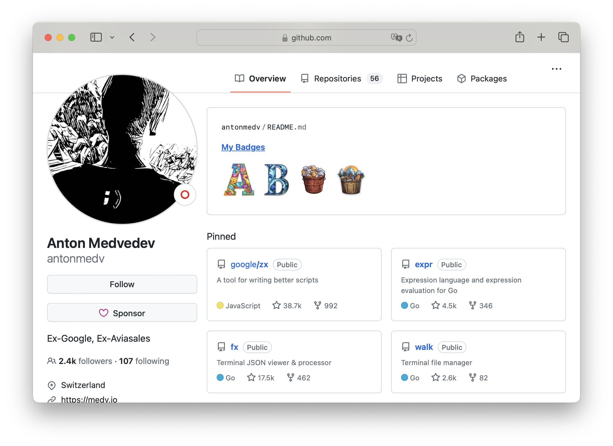
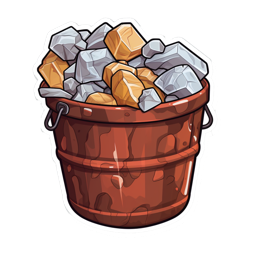

# My Badges

Generate badges for your profile.

## Example

Here is an example of how my badges look like in [my profile](https://github.com/antonmedv):

<p align="center"></p>

Here is all currently available badges:

<p>





</p>

But we are planning on adding much more. You can even add your own badges too!

## Usage

Here is how to add my badges to your profile:
- Star this repository.
- Create `your-username/your-username` repository.
- In `README.md` add the following code:
```html
<!-- my-badges start -->
<!-- my-badges end -->
```
- Add the following workflow `.github/workflows/my-badges.yml` to your repository.
```yaml
name: my-badges

on:
  workflow_dispatch:
  schedule:
    - cron: '0 0 * * *'

permissions:
  contents: write

jobs:
  my-badges:
    runs-on: ubuntu-latest
    steps:
      - name: Update My Badges
        run: npx update-my-badges ${{github.repository_owner}} --repo=${{ github.repository }}
        env:
          GITHUB_TOKEN: ${{ secrets.GITHUB_TOKEN }}
```
- Start `my-badges` workflow, or wait for it to run automatically.

## Contributing badges

If you want to contribute a badge:
- Add your badge to the [all-badges](./src/all-badges) folder.
- Add your badge to the [index.ts](./src/all-badges/index.ts) file.
- Any badge images are welcome (png, 256x256px).

### How to test locally?

Build project with next command:

```sh
npm run build
```

Run main.js with next command:

```sh
node dist/main.js your-username
```

This command will collect your data and save it to `data/your-username.json` file. 
You can skip recollecting the data with `--data` flag.

```sh
node dist/main.js your-username --data data/your-username.json
```

## License

[MIT](LICENSE)
